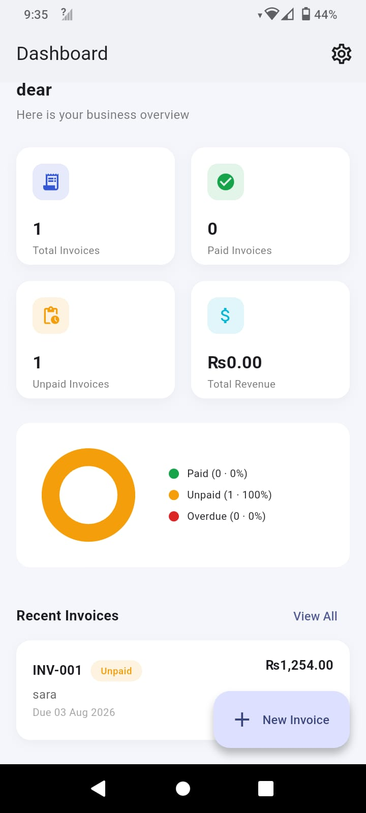
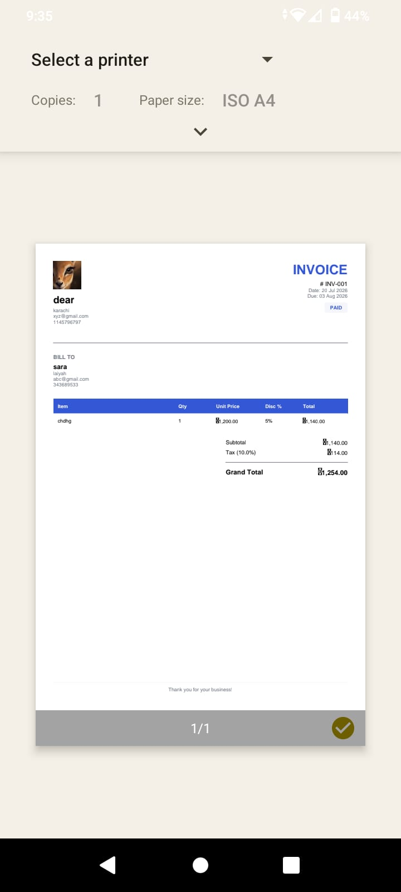
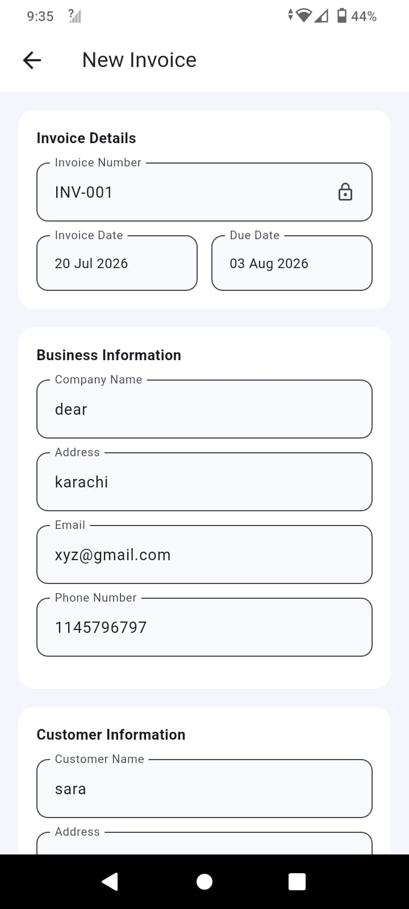
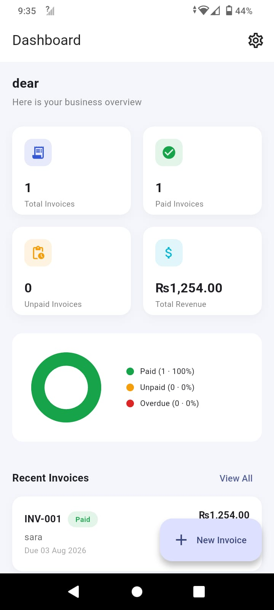
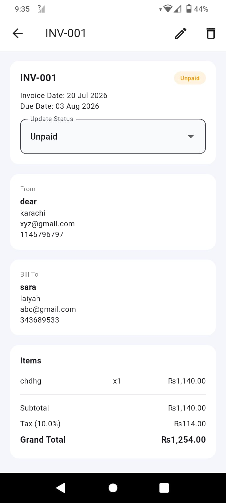
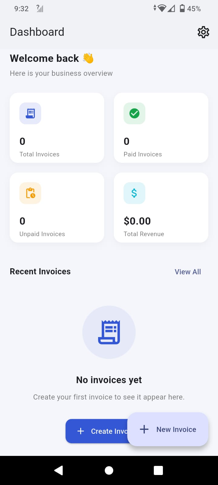

# 🧾 Invoice Generator — Flutter App

A clean, modern Flutter application for creating, managing, and exporting professional invoices. Built to demonstrate core Flutter fundamentals: navigation, forms & validation, local persistence (**Hive** + SharedPreferences), PDF generation, and full CRUD operations.

**Runs on Web, Android, and iOS from the same codebase** — the storage layer uses Hive (not sqflite) and the PDF/logo pipeline is fully byte-based with no `dart:io` file access, so there's nothing platform-specific to break on the web.

---

## 📋 Project Overview

Invoice Generator lets a small business owner or freelancer create invoices in minutes: fill in business and customer details, add line items, and the app automatically calculates subtotal, tax, and grand total. Invoices are stored locally on the device, can be searched/filtered/duplicated, marked Paid/Unpaid/Overdue, exported as PDF, shared via any installed app (WhatsApp, Email, etc.), and printed. A dashboard summarizes total invoices, revenue, and payment status at a glance.

---

## ✨ Features

### Core
- Create invoices with **auto-generated unique invoice numbers** (e.g. `INV-001`, `INV-002`, …)
- Invoice Date & Due Date pickers
- Business information (company name, address, email, phone) — pre-filled from Settings
- Customer information (name, address, email, phone)
- Multiple product/service line items with quantity, unit price, and optional discount %
- Automatic calculation of **Subtotal**, **Tax**, and **Grand Total**
- Notes / payment instructions field
- Local storage via **Hive** (works identically on Web, Android, iOS, Desktop)

### Invoice Management
- View all invoices in a searchable, filterable list
- Search by invoice number or customer name
- Filter by status: All / Paid / Unpaid / Overdue
- Edit existing invoices
- Delete invoices with a confirmation dialog
- Duplicate an invoice (generates a new invoice number and resets status/dates)
- Mark invoices as **Paid**, **Unpaid**, or **Overdue** (auto-flags overdue based on due date)

### Export & Sharing
- Generate a professional, branded **PDF** for any invoice
- Download PDF to the device
- **Share** the PDF via any installed app (WhatsApp, Email, etc.) using `share_plus`
- **Print** directly from the app using `printing`

### Dashboard
- Total Invoices, Paid Invoices, Unpaid Invoices, Total Revenue
- Paid / Unpaid / Overdue breakdown pie chart
- Recent invoices list

### Settings
- Upload company logo (used on invoice PDFs)
- Configure company details (name, address, email, phone)
- Select currency symbol
- Set default tax percentage
- Customize invoice number prefix (e.g. `INV-`, `BILL-`)
- Dark mode toggle

### UI / UX
- Clean Material 3 design, card-based layouts
- Responsive grid (adapts dashboard stat cards for tablet/desktop widths)
- Full input validation on all required fields
- Friendly empty states when no invoices exist
- Status badges (Paid / Unpaid / Overdue) with color coding

---

## 🧰 Packages Used

| Package | Purpose |
|---|---|
| `hive` + `hive_flutter` | Local NoSQL storage for invoices — works on **Web (IndexedDB), Android, iOS, and Desktop** with one API |
| `shared_preferences` | Persisting app Settings (company info, currency, tax, prefix) — also web-safe (uses `localStorage`) |
| `uuid` | Generating unique IDs for invoices and line items |
| `intl` | Date and number formatting |
| `pdf` | Building the invoice PDF document as raw bytes (no file system needed) |
| `printing` | Printing, previewing, and **sharing/downloading** the generated PDF — handles the Web download vs. native share-sheet difference automatically |
| `image_picker` | Uploading a company logo; read as bytes (`readAsBytes()`) and stored as base64 so it works without a filesystem on Web |
| `fl_chart` | Paid/Unpaid/Overdue breakdown chart on the dashboard |

### Why Hive instead of sqflite?
`sqflite` is backed by native SQLite bindings that don't exist in a browser, so it fails to build/run on Flutter Web without extra FFI/WASM shims. `Hive` is a pure-Dart key-value store with an official Web adapter (backed by IndexedDB), so the exact same `HiveHelper` code path works on Web, Android, and iOS with zero conditional logic. Each invoice is serialized to a JSON string and stored under its `id` in a single `invoices` box.

### Why no `dart:io` / `path_provider` / `share_plus`?
Those all assume a real filesystem, which the browser doesn't expose to Flutter Web apps. This version:
- Stores the uploaded **logo** as a base64 string (via `image_picker`'s `readAsBytes()`) instead of a file path, and renders it with `Image.memory` / `pw.MemoryImage`.
- Generates the **PDF** as raw bytes (`Uint8List`) instead of writing a file.
- Hands those bytes to `printing`'s `Printing.sharePdf()` (triggers a browser download on Web, the native share sheet on mobile) and `Printing.layoutPdf()` (opens the browser print dialog on Web, the native print flow on mobile) — one code path, every platform.

---

## 📁 Project Structure

```
lib/
├── main.dart                    # App entry point & theming
├── models/                      # Data models
│   ├── invoice.dart
│   ├── invoice_item.dart
│   ├── business_info.dart
│   ├── customer.dart
│   └── app_settings.dart
├── database/
│   └── hive_helper.dart         # Hive box setup & low-level CRUD (Web + Android + iOS)
├── services/
│   ├── invoice_service.dart     # Business logic: CRUD, search, stats
│   └── settings_service.dart    # SharedPreferences-backed settings
├── pdf/
│   └── invoice_pdf_generator.dart  # PDF layout & generation
├── screens/
│   ├── splash_screen.dart
│   ├── dashboard_screen.dart
│   ├── invoice_list_screen.dart
│   ├── invoice_form_screen.dart # Create & Edit (shared form)
│   ├── invoice_detail_screen.dart
│   └── settings_screen.dart
├── widgets/
│   ├── stat_card.dart
│   ├── invoice_card.dart
│   ├── status_badge.dart
│   ├── empty_state.dart
│   └── invoice_item_form_row.dart
├── utils/
│   ├── constants.dart           # Colors, spacing, currency options
│   ├── currency_formatter.dart  # Currency & date formatting
│   └── validators.dart          # Form field validators
└── assets/                      # (place any bundled images/icons here)
```

---

## 🚀 Setup Instructions

### Prerequisites
- [Flutter SDK](https://docs.flutter.dev/get-started/install) 3.x (Dart >= 3.0)
- Android Studio / VS Code with the Flutter & Dart plugins
- An Android device or emulator (for building the APK)

### 1. Clone the repository
```bash
git clone <your-repo-url>
cd invoice_generator
```

### 2. Generate platform folders
This repo ships the `lib/` source only. Generate the `android/` (and `ios/`, if needed) platform projects with:
```bash
flutter create .
```
This safely adds the platform scaffolding around the existing `lib/` and `pubspec.yaml` without overwriting your code.

### 3. Install dependencies
```bash
flutter pub get
```

No extra Android storage permissions are needed — the app no longer touches the filesystem directly (Hive + base64 logo + in-memory PDF bytes handle everything). Just set `minSdkVersion` to at least `21` in `android/app/build.gradle`.

### 4. Run the app

**On Android/iOS:**
```bash
flutter run
```

**On Web:**
```bash
flutter run -d chrome
```

### 5. Build for release

**Android APK:**
```bash
flutter build apk --release
```
The APK will be generated at:
```
build/app/outputs/flutter-apk/app-release.apk
```

**Web:**
```bash
flutter build web --release
```
The static site will be generated at `build/web/` — deploy it to any static host (Firebase Hosting, Netlify, GitHub Pages, etc.).

---

## 🗂️ Data Storage

- **Invoices & line items** are stored in a local SQLite database (`invoice_generator.db`) via `sqflite`.
- **App settings** (company profile, currency, tax %, invoice prefix, dark mode, logo path) are stored via `shared_preferences`.
- **Generated PDFs** and the **uploaded logo** are saved to the app's documents directory via `path_provider`.

All data lives entirely on-device — no backend/server is required.

---

## 📸 Screenshots


| Dashboard | Invoice List | New Invoice | Invoice Detail | Settings |
|---|---|---|---|---|
|  |  |  |  |  |  |


---

## 📄 License

This project is provided as-is for educational/demonstration purposes.
